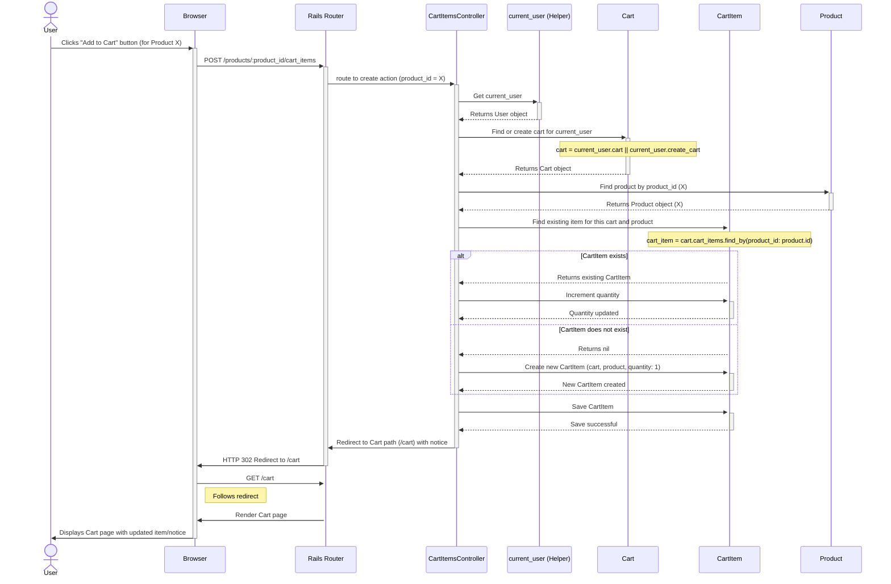

# Abito E-commerce - Sequence Diagram: Add to Cart

This diagram illustrates the sequence of events when a logged-in user adds a product to their shopping cart.

**Explanation:**

1.  The user clicks the "Add to Cart" button on a product page in their browser.
2.  The browser sends a POST request to the server, targeting the route defined for adding items to the cart (likely nested under products, e.g., `/products/3/cart_items`).
3.  The Rails Router maps this request to the `create` action within the `CartItemsController`.
4.  The controller first identifies the currently logged-in user (`current_user`).
5.  It then finds or creates the shopping cart associated with that user. Rails often handles this implicitly via associations (`user.cart` might automatically create one if it doesn't exist).
6.  The controller finds the specific `Product` being added based on the `product_id` from the URL parameters.
7.  It checks if a `CartItem` for this specific `Product` already exists within the user's `Cart`.
8.  **If it exists:** The quantity of the existing `CartItem` is incremented.
9.  **If it doesn't exist:** A new `CartItem` is created, linking the `Cart` and `Product`, with an initial quantity of 1.
10. The controller saves the changes to the `CartItem`.
11. The controller issues a redirect response, typically sending the user to their cart page (`/cart`) and setting a flash notice (e.g., "Product added to cart").
12. The browser receives the redirect response and automatically makes a new GET request to the cart page.
13. The server processes the request for the cart page, renders it (showing the newly added/updated item), and sends it back to the browser.
14. The user sees their updated shopping cart.
